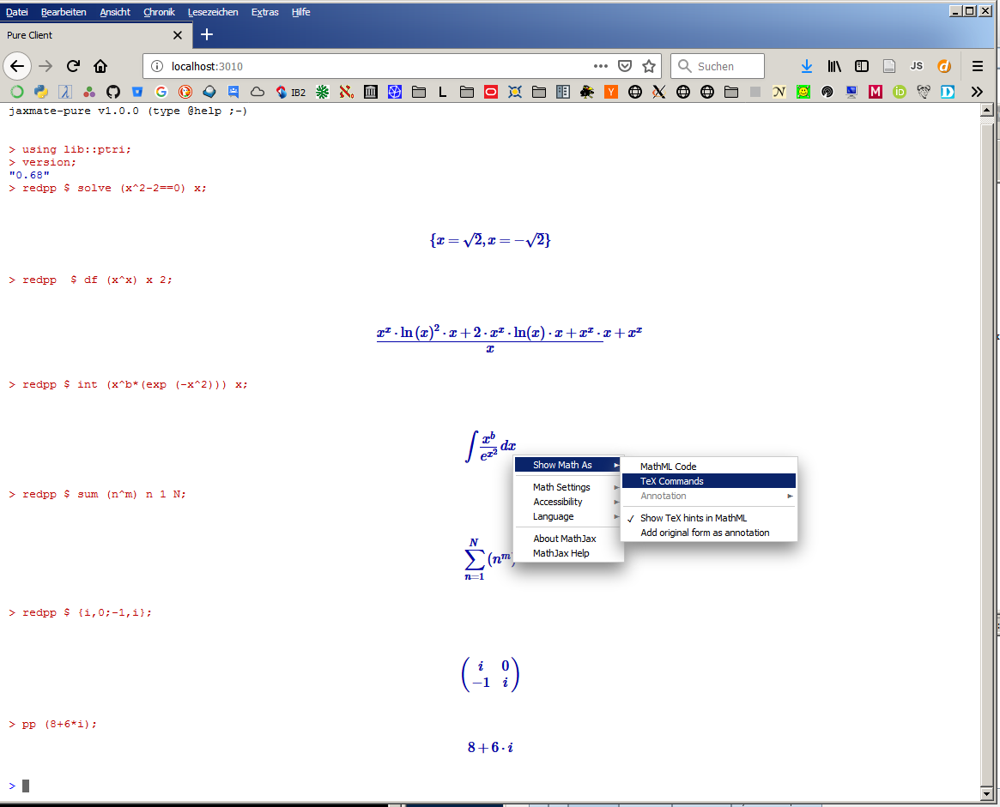
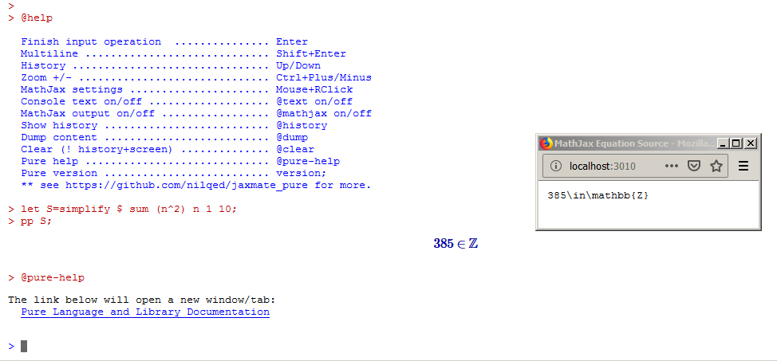

# jaxmate_pure
Pure node server + JaxMaTe client

Using a variant of [JaxMaTe](https://github.com/nilqed/jaxMaTe) tailored to the [Pure programming language](https://github.com/agraef/pure-lang).

## Quick install

Required:

* [node.js](https://nodejs.org/en/) (e.g. `sudo apt install nodejs`)
* [pure -i](), working (in path)

Get the repo:

	git clone https://github.com/nilqed/jaxmate_pure.git

Start:

* `cd jaxmate_pure`
* `node pure_server.js`
* open http://localhost:3010, (e.g. `firefox localhost:3010`)

 :heavy_exclamation_mark: Tested with Firefox Quantum only (for the moment) on Windows 7/10 and Ubuntu 18.x. 

